# 🚗 ParkMate - 주차장 중개 플랫폼

ParkMate는 운전자에게 실시간 주차 공간 정보를 제공하고, 주차장 소유주에게는 유휴 공간을 효과적으로 활용할 수 있는 기회를 제공하는 MSA(Microservice Architecture) 기반 주차장 중개 플랫폼입니다.
  

# 📷 접속 QR (배포 중단)

  

# 🚀 마이크로서비스 목록

각 서비스에 대한 자세한 내용은 해당 디렉토리의 `README.md` 파일을 참고해주세요.

| Service | Repository | Description |
| --- | --- | --- |
| **Frontend** | [`FE-park-mate`](https://github.com/3-park-mate/FE-park-mate) | 사용자 및 호스트를 위한 웹 애플리케이션 |
| **Discovery Server** | [`parkmate-discovery-server`](https://github.com/3-park-mate/parkmate-discovery-server/) | 서비스 등록 및 검색을 담당하는 Eureka 서버 |
| **API Gateway** | [`parkmate-gateway-service`](https://github.com/3-park-mate/parkmate-gateway-service/) | 모든 클라이언트 요청의 단일 진입점 |
| **Auth Service** | [`parkmate-auth-service`](https://github.com/3-park-mate/parkmate-auth-service/) | 주차장 소유주(호스트) 관련 기능 관리 |
| **User Service** | [`parkmate-user-service`](https://github.com/3-park-mate/parkmate-user-service/) | 사용자 인증 및 회원 정보 관리 |
| **Host Service** | [`parkmate-host-service`](https://github.com/3-park-mate/parkmate-host-service) | 주차장 소유주(호스트) 관련 기능 관리 |
| **Parking Service** | [`parkmate-parking-service`](https://github.com/3-park-mate/parkmate-parking-service) | 주차장 정보(CRUD) 관리 (Write Model) |
| **Parking Read Service** | [`parkmate-parking-read-service`](https://github.com/3-park-mate/parkmate-parking-read-service) | 주차장 정보(READ) 관리 (READ Model) |
| **Batch Service** | [`parkmate-batch-service`](https://github.com/3-park-mate/parkmate-batch-service) | 배치 관련 기능 관리 |
| **Review Service** | [`parkmate-review-service`](https://github.com/3-park-mate/parkmate-review-service) | 주차장 리뷰 관련 기능 관리 |
| **Review Read Service**| [`parkmate-review-read-service`](https://github.com/3-park-mate/parkmate-review-read-service)| 리뷰 READ 데이터 관리 |
| **Reservation Service**| [`parkmate-reservation-service`](https://github.com/3-park-mate/parkmate-reservation-service)| 주차장 예약 관리 |
| **Order Service** | [`parkmate-order-service`](https://github.com/3-park-mate/parkmate-order-service) | 예약에 따른 주문 생성 및 관리 |
| **Payment Service** | [`parkmate-payment-service`](https://github.com/3-park-mate/parkmate-payment-service) | 결제 처리 및 외부 PG 연동 |
| **Notification Service**| [`parkmate-notification-service`](https://github.com/3-park-mate/parkmate-notification-service)| 푸시 알림 발송 |
| **History Service** | [`parkmate-user-parking-history`](https://github.com/3-park-mate/parkmate-user-parking-history)| 주차장 입/출차 내역 관리 |
| **Chat Service** | [`parkmate-chat-service`](https://github.com/3-park-mate/parkmate-chat-service) | 채팅 관련 기능 관리 |

  

# 🏛️ 시스템 아키텍처

본 프로젝트는 각 기능이 독립적인 마이크로서비스로 분리되어 있으며, API Gateway를 통해 외부 요청을 처리합니다. 서비스 간의 통신, 서비스 검색 및 관리를 위해 Service Discovery, Message Queue 등의 패턴을 적용했습니다.

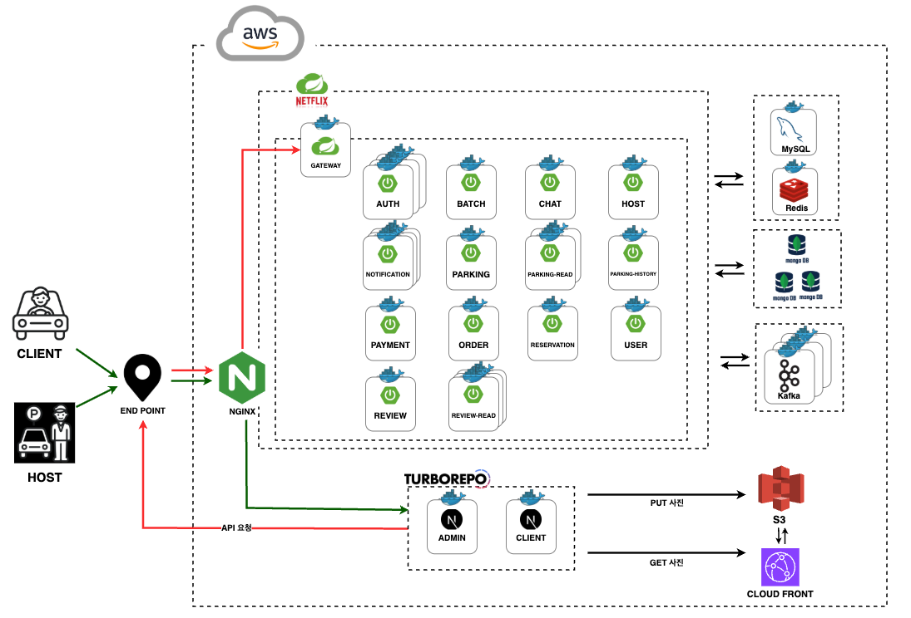
  

# 📈 CI/CD 파이프라인

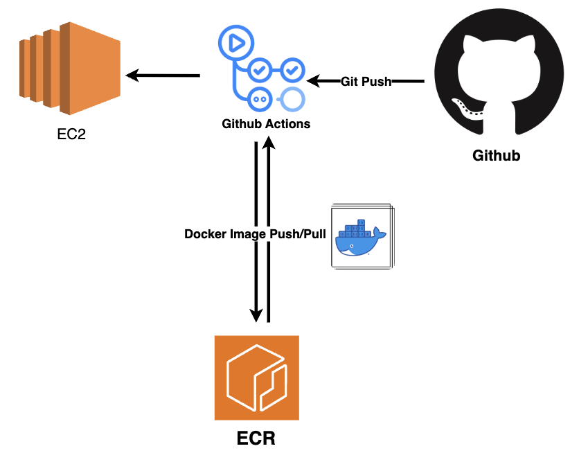

  
# 🧾 ERD

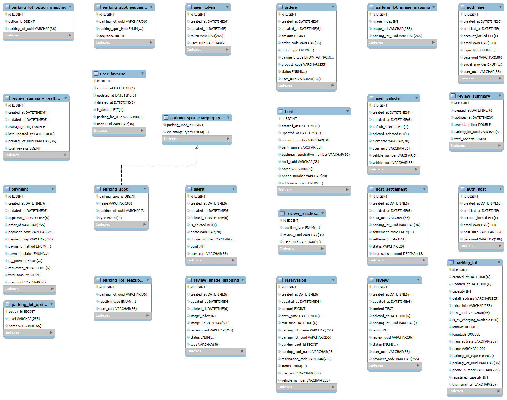
  

# 🛠️ 기술 스택

| 구분 | 기술 |
| --- | --- |
| **Backend** |          |
| **Frontend** |        |
| **Database** |    |
| **Infrastructure** |    ,  |
| **Build Tool** |   |
| **Common** |   |

  

# 📱 화면 구성

|  회원가입 및 로그인   |
| :---: |
| 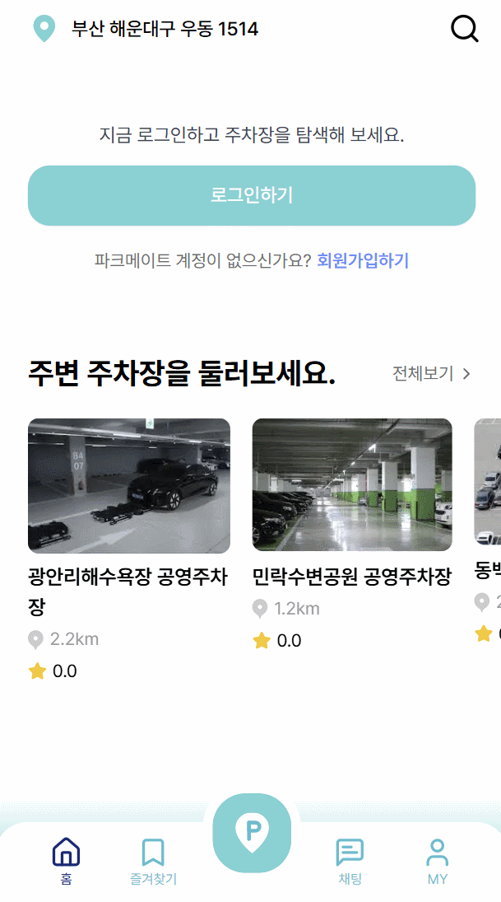  | 

|  주차장 등록   | 주차장 관리 | 
| :---: | :---: | 
|    |  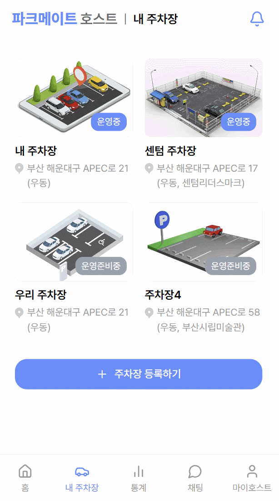   |  

|  주차장 조회   |  주차장 상세 페이지  |
| :---: | :---: |
| 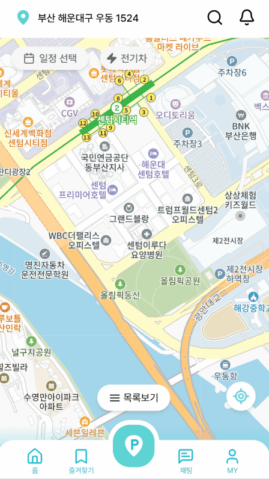 |  |

|  내차량관리   |  즐겨찾기   |
| :---: | :---: |
| 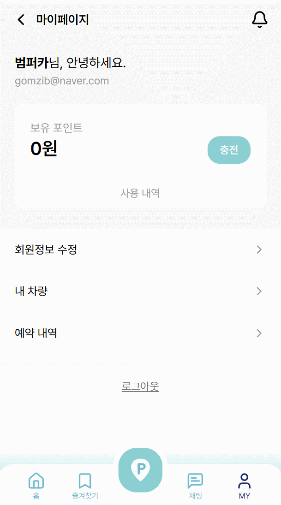    |      |   

| 예약 | 예약정보 |  예약완료알림   |  결제   |
| :---: | :---: | :---: | :---: |
| 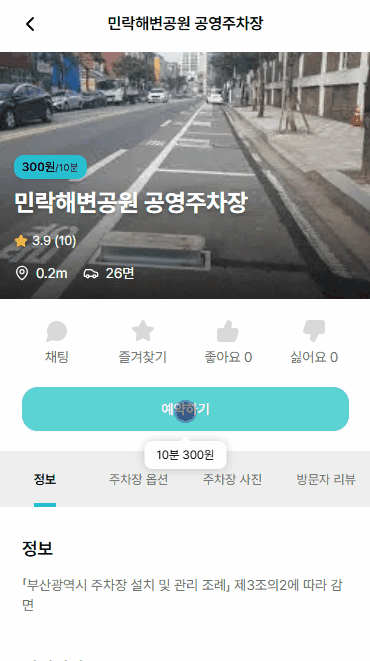  | 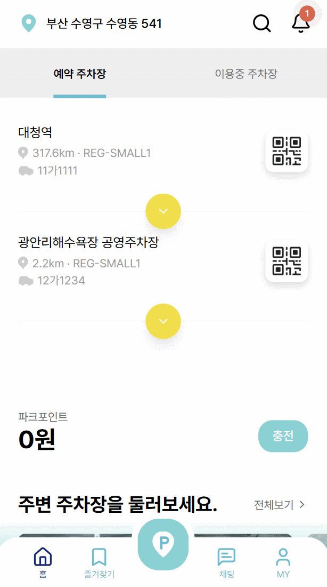 | 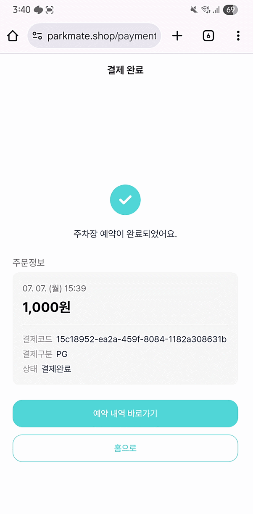 |  |   

  

# ✨ 주요 기능

- **사용자**: 회원가입, 로그인, 프로필 관리
- **호스트**: 주차장 등록, 관리 및 수익 정산
- **주차장 검색**: 위치 기반 실시간 주차장 정보 조회, 필터링 및 검색
- **예약 및 결제**: 간편한 주차 공간 예약 및 결제 시스템
- **알림**: 예약, 결제 등 주요 이벤트에 대한 실시간 알림
- **이용 내역**: 사용자의 주차 이용 내역 조회
  

# 🤝 협업

### 💬 Slack을 통한 소통
모든 팀원은 Slack으로 소통하며, 중요한 논의 내용 또는 PR 확인 메시지를 통해 신속한 작업이 이루어지도록 했습니다.
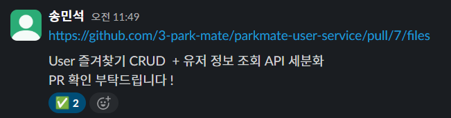

### 🐛 이슈 관리
모든 작업은 Github Issues에 등록하여 관리하며, Issue에 등록된 업무를 기준으로 작업을 진행했습니다.
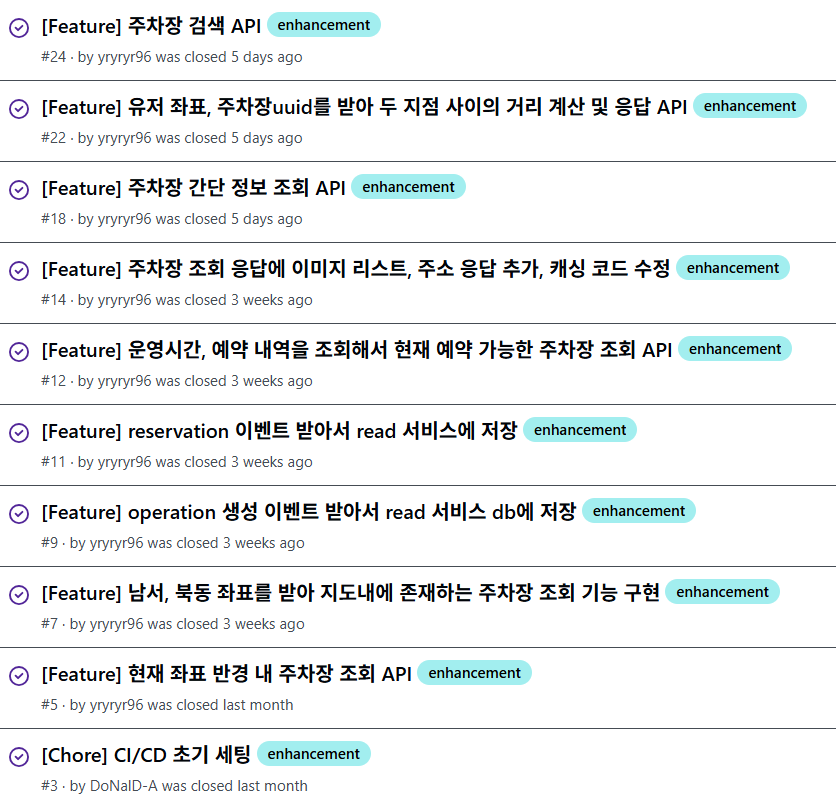

### 📝 커밋 컨벤션
명확하고 일관된 커밋 메시지 규칙을 따라 코드 변경 내역을 쉽게 파악할 수 있도록 했습니다.

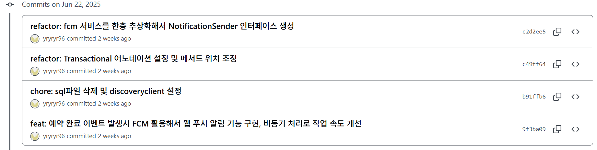

### 🔀 PR(Pull Request) 프로세스
모든 코드는 PR을 통해 리뷰를 거치며, 최소 2명 이상의 팀원에게 `approve`를 받아야 머지할 수 있습니다.
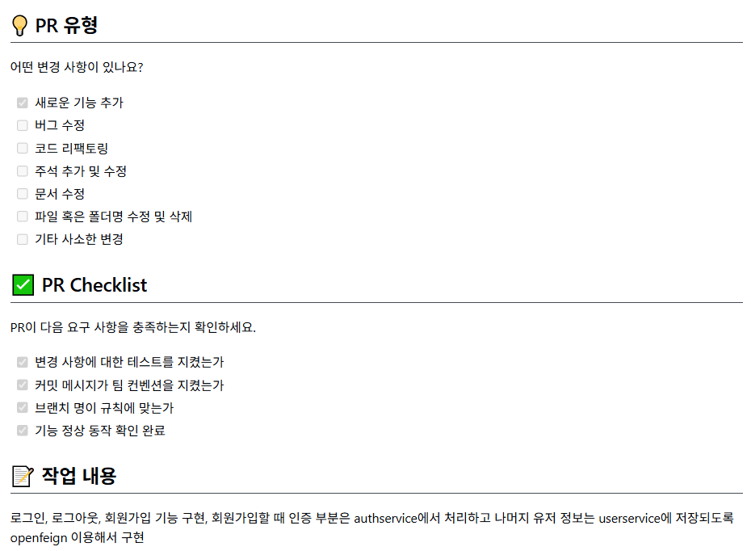
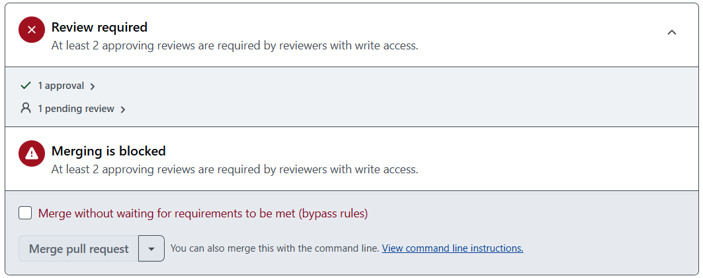

### ⚡ 이벤트 스토밍

  

# 📊 WBS
📎 [Link](https://docs.google.com/spreadsheets/d/11S0fp9Y6vst6RtbusKjoVJ72BpezUXwU6aG5bn_pgLM/edit?gid=118836952#gid=118836952)
  

# 📑 API 명세서
📎 [Link](https://docs.google.com/spreadsheets/d/11S0fp9Y6vst6RtbusKjoVJ72BpezUXwU6aG5bn_pgLM/edit?gid=1680415821#gid=1680415821)

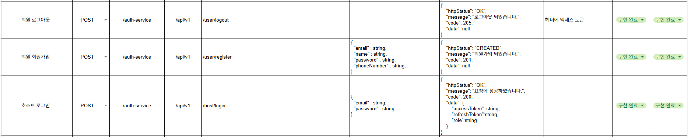
  

# 👥 팀원 소개
| 이름 | 역할 |
| --- | --- |
| 정영록 | BE(팀장), 주차장, 예약, 주문, 알림 도메인 |
| 송민석 | BE, INFRA, 유저, 결제, 채팅 |
| 김보미 | BE, 인증,리뷰,호스트 |
| 윤예지 | FE, 지도, 예약, 검색, 채팅 |
| 윤채영 | FE, 인증, 주차장, 알림, 결제, 호스트 |

  

# 💬 느낀점
| 이름 | 느낀점 |
| --- | --- |
| 정영록 | 단순 구현도 중요하지만 많은 문제를 시스템 아키텍처 설계로 해결할 수 있다는 것을 배웠습니다. |
| 송민석 | 서버를 운영해보며 기업들이 서버 최적화를 진행하는 이유와 즉각적인 장애 대응을 할 수 있는 설계의 중요성에 대해 생각해볼 수 있었습니다. |
| 김보미 | 프로젝트를 처음부터 끝까지 직접 만들어보며 개발의 흐름을 배울 수 있었고, 스스로 성장하고 있다는 걸 느낄 수 있는 시간이었습니다. |
| 윤예지 | 처음 구현해보는 기능들이 많아서 흥미롭게 프로젝트를 진행할 수 있었고,  개발 관련 경험 뿐 아니라 팀 협업을 배울 수 있어서 유익했습니다. |
| 윤채영 | 팀업 활동으로 각각 개발 역할의 중요성과 맡은 역할의 책임감을 배웠습니다. |
